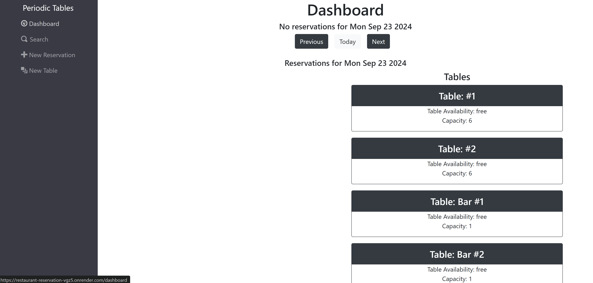
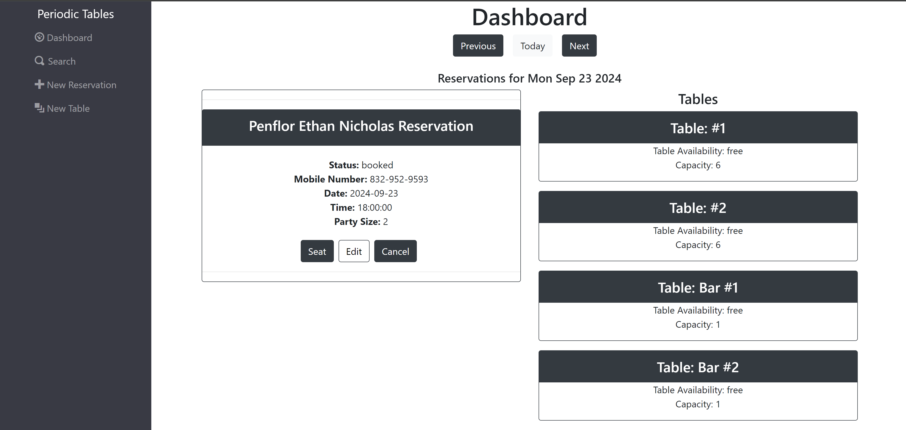
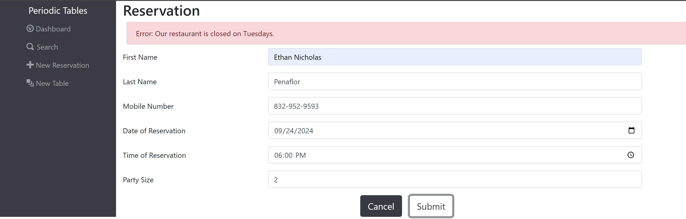
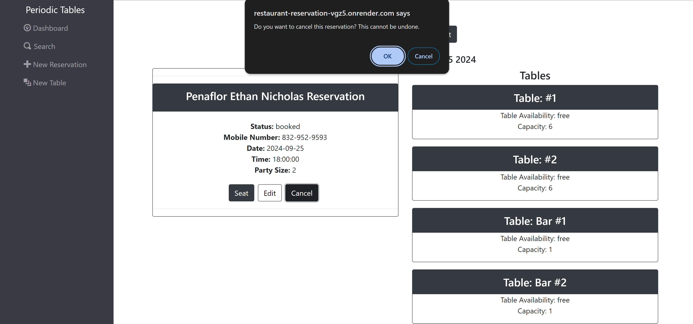
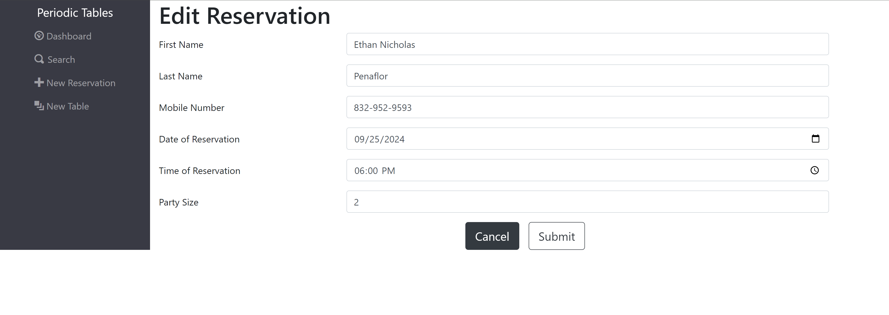
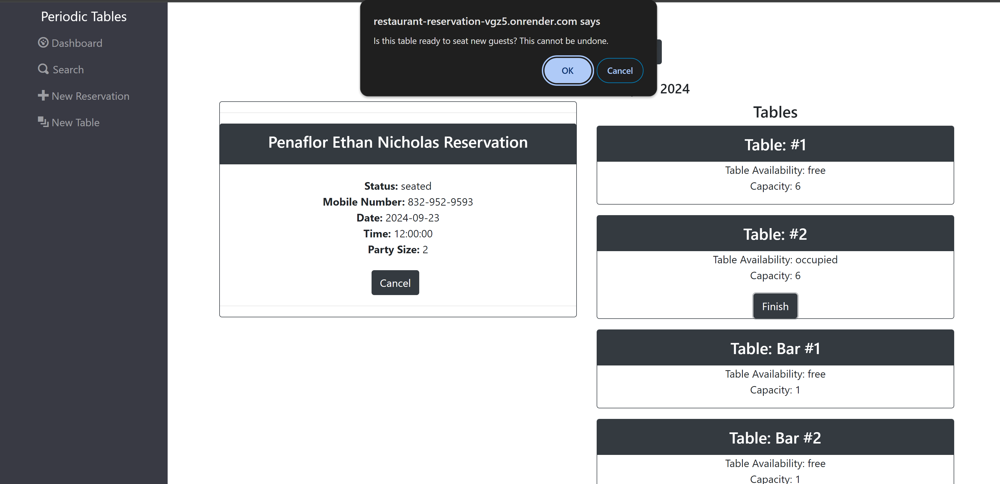
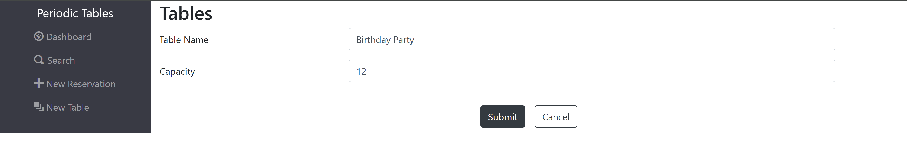
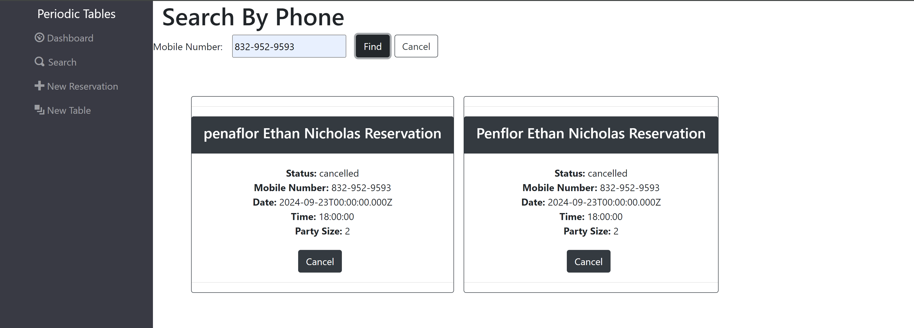

# Capstone: Restaurant Reservation System

## Description

This is my final capstone for Thinkful's Software Engineering program. I was tasked with creating a full-stack reservation system for a mock restaurant, _Periodic Tables_. The goal was to complete 8 user stories within a monorepo and successfully deploy a live website. This applications allows the restaurant employees to book, edit, cancel, and search for reservations in the database using customers' phone numbers.

## Website Link

Link: https://restaurant-reservation-64ap.onrender.com

## Application Features

If there are no current reservations for the date selected, the reservations section on the dashboard will be left blank.

Any existing reservations and tables on the given date are displayed on the dashboard. Selecting the `next` button takes users to the next day, selecting `previous` takes users to the previous day, and `today` navigates to the current day.

Selecting `New Reservation` allows the user to create a new reservation. Users will be alerted if there any errors when filling out the form.

When a new form is submitted on a selected date, the reservation will be displayed on the dashboard. Users will then have the option of editing, canceling, or seating a reservation. 

The `Edit` button navigates employees to the edit form, which allows them to edit reservations. Forms are prefilled with the current reservations data. 

When a table is occupied, a `Finish` button will appear on the tables card. If the finish button is selected, a pop-up message will appear giving users the option to change the table's status back to `free`.

Selecting `New Table` allows users to create a new table.

Selecting the `Search` button will take users to the search form where they can search for a reservation by their number.

## Technologies Used

`Back-end`

- Node
- Express
- PostgreSQL (via ELephantSQL)
- Knex
- Jest

`Back-end` 
API Base Url: https://restaurant-reservation-x2ir.onrender.com

`Front-end`

- React
- Bootstrap
- e2e tests
- Puppeteer

## Installation

1. Fork and clone this repository.
1. Run `cp ./back-end/.env.sample ./back-end/.env`.
1. Update the `./back-end/.env` file with the connection URL's to your ElephantSQL database instance.
1. Run `cp ./front-end/.env.sample ./front-end/.env`.
1. You should not need to make changes to the `./front-end/.env` file unless you want to connect to a backend at a location other than `http://localhost:5001`.
1. Run `npm install` to install project dependencies.
1. Run `npm run start:dev` to start your server in development mode.

If you have trouble getting the server to run, reach out for assistance.
